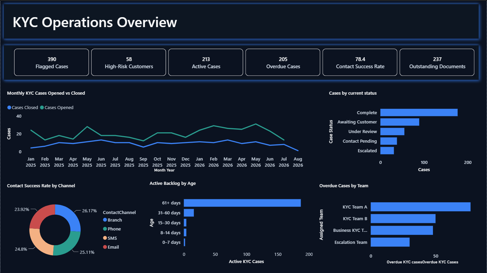
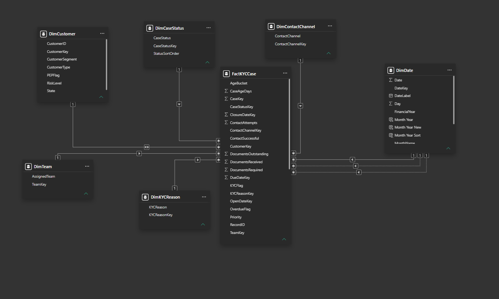

# KYC Customer Contact & Remediation Analytics

A Power BI portfolio project analysing customer risk, contact performance, document remediation, operational backlog and team workload.

> **Disclaimer:** This project uses fully synthetic data. It contains no real customer, banking or compliance information.

## Dashboard Preview

## Project Summary

The report helps users:

- Monitor active, overdue and completed KYC cases
- Identify high-risk customers
- Analyse contact success by channel
- Track outstanding customer documents
- Compare backlog and performance across teams
- Monitor monthly cases opened versus closed

## Key Results

- **1,000** synthetic customers
- **390** flagged KYC cases
- **213** active cases
- **205** overdue cases
- **58** high-risk flagged customers
- **78.4%** contact success rate
- **237** outstanding documents

## Report Pages

1. **KYC Operations Overview** — Executive KPIs and monthly trends
2. **Customer & KYC Risk** — Risk, segment and customer analysis
3. **Contact & Documents** — Contact and remediation performance
4. **Backlog & Team** — Case ageing, overdue workload and team performance

## Data Model

The report uses a star schema with one fact table and six dimension tables.

## Skills Demonstrated

- Power BI dashboard development
- Power Query data preparation
- DAX measures
- Star-schema data modelling
- Active and inactive date relationships
- Interactive slicers and page navigation
- Operational KPI and trend analysis

## Tools

**Power BI Desktop | Power Query | DAX | Excel | GitHub**

## Additional Screenshots

- [Customer & KYC Risk Analytics](03-customer-risk-analytics.png)
- [Contact & Document Performance](04-contact-document-performance.png)
- [Backlog & Team Performance](05-backlog-team-performance.png)
- [Report Home Page](01-home.png)

## Download

[Download the Power BI report](KYC_Customer_Contact_Analytics.pbix)

Power BI Desktop is required to open the `.pbix` file.

## Author

**Jagminder Singh**  
Master of Data Science and Decisions, UNSW Sydney

